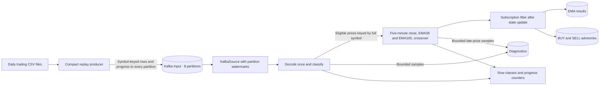

# Trading trend detection

```mermaid
flowchart LR
    CSV[Daily trading CSV files] --> Replay[Compact replay producer]
    Replay -->|Symbol-keyed rows and progress to every partition| Input[(Kafka input · 8 partitions)]
    Input --> Source[KafkaSource with partition watermarks]
    Source --> Classify[Decode once and classify]
    Classify -->|Eligible prices keyed by full symbol| Analytics[Five-minute close, EMA38 and EMA100, crossover]
    Analytics --> Subscriptions[Subscription filter after state update]
    Subscriptions --> Windows[(EMA results)]
    Subscriptions --> Advice[(BUY and SELL advisories)]
    Classify -->|Bounded samples| Diagnostics[(Diagnostics)]
    Analytics -->|Bounded late-price samples| Diagnostics
    Classify --> Metrics[Row classes and progress counters]
    Analytics --> Metrics
```

