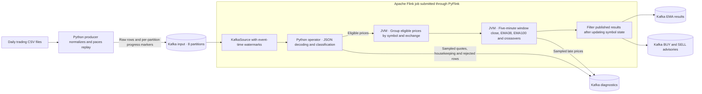

# Trading trend detection

The diagram shows the optimized streaming path used in Test 2.

```mermaid
flowchart LR
    CSV[Daily trading CSV files] --> Replay[Python producer normalizes and paces replay]
    Replay -->|Raw rows and per-partition progress markers| Input[(Kafka input · 8 partitions)]

    subgraph Flink["Apache Flink job submitted through PyFlink"]
        Source["KafkaSource with event-time watermarks"]
        Classify["Python operator · JSON decoding and classification"]
        KeyBy["JVM · Group eligible prices by symbol and exchange"]
        Analytics["JVM · Five-minute window close, EMA38, EMA100 and crossovers"]
        Subscriptions["Filter published results after updating symbol state"]

        Source --> Classify
        Classify -->|Eligible prices| KeyBy
        KeyBy --> Analytics
        Analytics --> Subscriptions
    end

    Input --> Source
    Subscriptions --> Windows[(Kafka EMA results)]
    Subscriptions --> Advice[(Kafka BUY and SELL advisories)]
    Classify -->|Sampled quotes, housekeeping and rejected rows| Diagnostics[(Kafka diagnostics)]
    Analytics -->|Sampled late prices| Diagnostics
```

